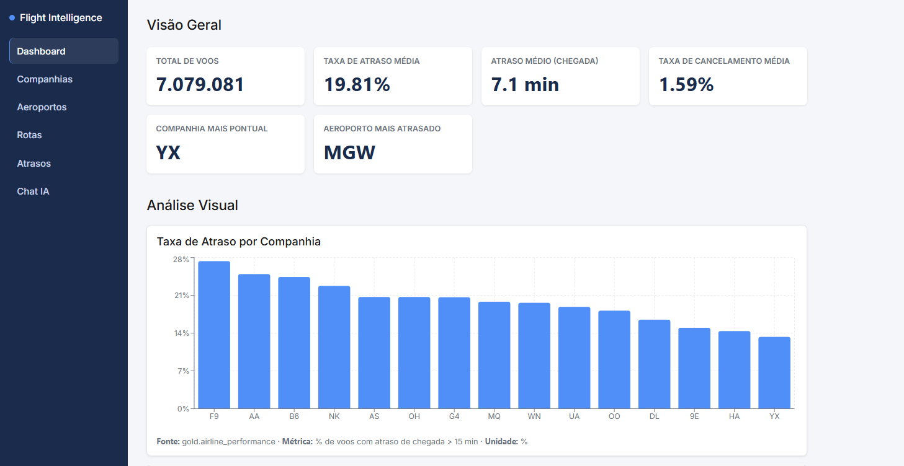
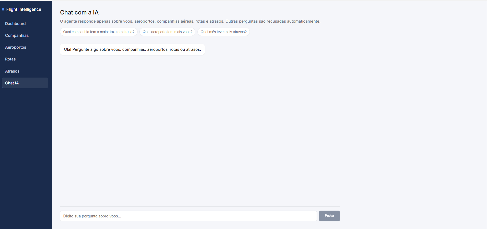

# ✈️ Flight Intelligence Platform

Plataforma completa de inteligência de dados para o setor aéreo — do
processamento de mais de **7 milhões de voos** até um dashboard interativo
e um agente de IA que responde perguntas em linguagem natural.

---

## 📊 Sobre o Projeto

O setor aéreo gera um volume enorme de dados (voos, horários, atrasos,
cancelamentos, companhias, aeroportos, rotas), mas esses dados costumam
existir de forma bruta e fragmentada, dificultando análise e tomada de
decisão.

Este projeto resolve isso construindo um **pipeline de dados de ponta a
ponta**: ingestão de milhões de registros, tratamento e validação de
qualidade, modelagem analítica, disponibilização via API, visualização em
dashboard e um agente de IA para consultas em linguagem natural — tudo
containerizado e pronto para rodar com um único comando.

---

## 📸 Screenshots

### Dashboard


### Chat com IA


---

## 🏗️ Arquitetura

```text
   📂 DATASET (7.079.081 voos, Kaggle/BTS)
        │
        ▼
   🥉 BRONZE → 🥈 SILVER → 🥇 GOLD   (PySpark + Delta Lake, Databricks)
        │
        ▼
   🐬 MySQL (5 tabelas analíticas)
        │
        ▼
   🚀 API — FastAPI
        │
   ┌────┴─────────────┐
   ▼                  ▼
💻 Frontend        🤖 Agente de IA
React + TS         Gemini (SQL validado)
```

- **Bronze**: dados brutos, sem transformação de negócio. A leitura do CSV é a
  primeira célula do notebook — não existe camada de ingestão separada.
- **Silver**: dados limpos, validados e padronizados (11 regras documentadas em
  [Regras de Transformação (Silver)](docs/documentacao_completa.md#5-regras-de-transformação-silver)), mais a dimensão
  `dim_airports`, que dá nome aos aeroportos sem depender de dado externo.
- **Gold**: 5 tabelas analíticas prontas para consumo (`airline_performance`,
  `airport_performance`, `route_performance`, `delay_causes`, `flight_trends`).

Pipeline executado sobre o dataset completo em **~58s** no Databricks Free
Edition. Arquitetura completa e decisões de camada em
[Arquitetura Geral](docs/documentacao_completa.md#8-arquitetura-geral); os notebooks e como reproduzir
em [`notebooks/README.md`](notebooks/README.md).

---

## 🛠️ Tecnologias

| Camada | Tecnologia |
|---|---|
| Engenharia de Dados | Python, PySpark, Databricks, Delta Lake |
| Banco de Dados | MySQL |
| Backend | Python, FastAPI, SQLAlchemy |
| Frontend | React, TypeScript, Vite, Recharts |
| Inteligência Artificial | Gemini API (Google) |
| Containerização | Docker, Docker Compose |
| Versionamento | Git, GitHub |

---

## 📁 Estrutura do Projeto

```text
flight-intelligence-platform/
├── backend/            # API FastAPI + agente de IA
├── frontend/           # React + TypeScript (ver frontend/README.md)
├── database/           # schema.sql e dump de dados
├── docker/             # Dockerfiles de backend e frontend
├── docs/               # documentação técnica detalhada
├── notebooks/          # notebooks PySpark (ver notebooks/README.md)
├── scripts/            # utilitários de desenvolvimento
├── docker-compose.yml
└── LICENSE
```

---

## 🚀 Como Executar

### Opção 1 — Docker (recomendado)

Sobe banco, backend e frontend com um comando. Pré-requisito: Docker Desktop
instalado e aberto.

```bash
# 1. Clone o repositório
git clone https://github.com/jppatriotacarvalho/flight-intelligence-platform.git
cd flight-intelligence-platform

# 2. Configure as variáveis de ambiente
cp .env.example .env
# edite o .env com sua senha de MySQL e sua chave da Gemini API

# 3. Suba tudo
docker compose up --build
```

O MySQL é populado automaticamente na primeira execução — não é preciso rodar
o pipeline do Databricks para ver a plataforma funcionando. O entrypoint roda
três arquivos, nesta ordem (ele os executa em ordem alfabética):

| Ordem | Arquivo | O que faz |
|---|---|---|
| `01_dump.sql` | `database/flight_intelligence_dump.sql` | cria e popula as 5 tabelas Gold |
| `02_airport_names.sql` | `database/airport_names.sql` | preenche os nomes dos aeroportos (gerado por `scripts/gerar_nomes_aeroportos.py` a partir do CSV do BTS) |
| `03_readonly_user.sh` | `database/03_readonly_user.sh` | cria o usuário `flight_reader`, só com `SELECT` |

> O init do MySQL **só roda com o volume vazio**. Depois de mudar qualquer um
> desses arquivos, use `docker compose down -v` antes de subir de novo.

### Opção 2 — Local, sem Docker

Útil para desenvolver com reload automático.

```bash
# 1. Banco: crie o schema e carregue o dump no seu MySQL
mysql -u root -p < database/schema.sql
mysql -u root -p flight_intelligence < database/flight_intelligence_dump.sql

# 1b. Nomes dos aeroportos (depois do dump — ele so' traz as colunas vazias)
mysql -u root -p flight_intelligence < database/airport_names.sql

# 2. Backend
cd backend
python -m venv venv
venv\Scripts\activate          # Windows;  no Linux/Mac: source venv/bin/activate
pip install -r requirements.txt
cp .env.example .env           # preencha DB_PASSWORD e GEMINI_API_KEY
cd ..

# 3. Frontend
npm --prefix frontend install

# 4. Suba backend e frontend juntos, a partir da raiz
npm install
npm run dev
```

> **Opcional — usuário só de leitura no MySQL local.** No Docker a API já
> conecta assim; para reproduzir localmente, rode o SQL abaixo e aponte
> `DB_USER`/`DB_PASSWORD` do `backend/.env` para ele (há um exemplo comentado
> em `backend/.env.example`). Usar `root` continua funcionando.
>
> ```sql
> CREATE USER IF NOT EXISTS 'flight_reader'@'localhost' IDENTIFIED BY 'sua_senha';
> GRANT SELECT ON flight_intelligence.airline_performance TO 'flight_reader'@'localhost';
> GRANT SELECT ON flight_intelligence.airport_performance TO 'flight_reader'@'localhost';
> GRANT SELECT ON flight_intelligence.route_performance   TO 'flight_reader'@'localhost';
> GRANT SELECT ON flight_intelligence.delay_causes        TO 'flight_reader'@'localhost';
> GRANT SELECT ON flight_intelligence.flight_trends       TO 'flight_reader'@'localhost';
> FLUSH PRIVILEGES;
> ```

### Acessos

| O quê | Endereço |
|---|---|
| Dashboard (frontend) | http://localhost:5173 |
| API — documentação interativa (Swagger) | http://localhost:8000/docs |
| API — endpoints | http://localhost:8000 |

---

## ✨ Funcionalidades

- **Dashboard interativo** — 6 KPIs (total de voos, taxa de atraso, atraso
  médio de chegada, taxa de cancelamento, companhia mais pontual, aeroporto
  mais atrasado), cada um com a linha de apoio dizendo o **critério** usado, e
  um gráfico próprio para cada pergunta de negócio citada nas seções —
  fonte/métrica/unidade documentadas em todos.
- **Nomes de verdade, não códigos** — aeroportos aparecem como `ATL` +
  "Atlanta, GA" e companhias como `YX` + "Republic Airways" (Decisões 03 e 04).
  O código continua sendo a chave; o nome é contexto.
- **Tabelas ordenáveis** — clique no cabeçalho para ordenar por qualquer
  coluna, em cima de **todos** os registros filtrados (não só da primeira
  página), com nulos no fim e navegação por teclado.
- **Piso de volume nos rankings** — ordenar por taxa sem piso coloca um
  aeroporto de 37 voos no topo. Os limiares são constantes nomeadas, aparecem
  na tela e podem ser desmarcados (Decisão 05).
- **Dispersão atraso × cancelamento** — as duas taxas de cada companhia no
  mesmo gráfico, bolha proporcional ao volume e linhas nas médias ponderadas
  do setor, formando quadrantes.
- **Páginas de dados** — Companhias, Aeroportos e Rotas (com filtro por
  origem/destino), Atrasos (motivos e evolução mensal).
- **Busca por sigla ou por nome** — `GET /airports?search=` casa tanto "ATL"
  quanto "Atlanta".
- **API REST** — endpoints `/dashboard`, `/airlines`, `/airports`,
  `/routes`, `/delays`, `/trends`, documentação automática em `/docs`.
- **Chat com IA** — pergunte em português ("Qual companhia tem a maior
  taxa de atraso?") e receba resposta em linguagem natural, com o SQL
  gerado disponível para consulta.

---

## 🔒 Agente de IA — segurança e resiliência

O agente converte perguntas em SQL via Gemini, mas nada do que o modelo gera
chega ao banco sem passar por um validador. Documentação completa em
[Agente de IA — Segurança e Resiliência](docs/documentacao_completa.md#10-agente-de-ia--segurança-e-resiliência).

**Segurança**

- Somente `SELECT`, comando único, sem `SELECT *`
- **Whitelist de tabelas** — apenas as 5 tabelas Gold, nunca Bronze/Silver
  nem `information_schema`. As colunas permitidas são passadas no prompt;
  o validador confere as tabelas, não cada coluna (limitação registrada
  abertamente na doc, item 1.5)
- Keywords de escrita, DDL, acesso a arquivo (`INTO OUTFILE`, `LOAD_FILE`) e
  funções de tempo (`SLEEP`, `BENCHMARK`) bloqueadas; comentários e variáveis
  de sessão também
- `LIMIT` obrigatório (máx. 100 linhas)
- Perguntas fora do escopo são recusadas antes mesmo de gerar SQL
- **Usuário MySQL somente leitura** — no Docker, a API conecta como
  `flight_reader`, com `GRANT SELECT` tabela por tabela nas 5 tabelas Gold.
  A aplicação **não consegue escrever mesmo que o validador falhe**
- Nenhuma credencial é enviada ao modelo, e o erro do banco não volta cru
  pela API

**Resiliência** — o que faz o chat continuar respondendo no free tier:

- **Cadeia de fallback entre 6 modelos Gemini**, com retentativa só em erro
  transitório (503) e descarte imediato em 429 de cota
- **Cooldown de 15 min por modelo** que estourou a cota, para as perguntas
  seguintes não gastarem a cadeia de novo nos mesmos modelos mortos
- **Tetos de tempo** — 45s para a cadeia inteira, 25s por chamada, para o
  frontend nunca ficar pendurado
- **Uma chamada por pergunta em vez de duas**: o mesmo JSON traz o SQL e o
  molde da resposta. Corta a cota pela metade e, como os números são
  formatados em Python, **o modelo nunca vê os dados** — não tem como
  arredondar errado nem inventar valor

---

## 🧪 Testes

**Suíte automatizada — 35 testes:**

```bash
# uma vez
backend\venv\Scripts\python -m pip install -r backend/requirements-dev.txt

# a cada mudança
backend\venv\Scripts\python -m pytest backend/tests -q
```

Nenhum teste precisa de MySQL nem de cota do Gemini: o de dashboard sobe um
SQLite em memória e sobrescreve a dependência `get_db`; os outros testam
funções puras.

| Arquivo | O que cobre |
|---|---|
| `test_validate_sql.py` | os 10 payloads de ataque e as 5 consultas legítimas documentadas, caso a caso |
| `test_format_answer.py` | formatação pt-BR, fallback de nome nulo para sigla, nome da companhia |
| `test_dashboard.py` | KPIs Σ ÷ Σ, atraso ponderado e piso de volume do aeroporto mais atrasado |

Além disso: pipeline de dados validado (7.079.081 registros, Bronze → Silver →
Gold sem perdas), API testada com casos de erro, agente de IA testado contra
tentativas de burlar a segurança via linguagem natural, e frontend verificado
em telas estreitas. **Seis bugs reais** foram encontrados e corrigidos.
Relatório completo no
[capítulo "Testes Realizados" da documentação](docs/documentacao_completa.md).

---

## 📊 Data Source

Este projeto usa o **Flight Delay Dataset — 2024**.

- **Fonte:** Kaggle
- **Fonte original:** BTS TranStats — On-Time Performance Database
- **Licença:** CC0 — Creative Commons Zero
- **Volume:** 7.079.081 registros, 35 colunas, voos domésticos dos EUA em 2024

---

## 📚 Processo de Documentação

Ao longo do desenvolvimento, cada etapa do projeto foi documentada
internamente: o problema de negócio e o público-alvo, as 35 colunas do
dataset (tipo, nulos, classificação), os achados da análise exploratória
de qualidade, as perguntas de negócio que a plataforma responde, as
regras de limpeza aplicadas na camada Silver, a definição oficial dos
KPIs, a arquitetura de cada camada, o modelo do banco de dados e a
validação da importação, o pipeline de segurança do agente de IA, o
relatório de testes realizados, e as decisões técnicas que desviaram do
plano original (como a troca de PostgreSQL por MySQL, a escolha de
Python/FastAPI para o backend e o tratamento do nome do aeroporto como
atributo, não como chave). Essa documentação guiou o desenvolvimento
passo a passo. [A documentação técnica completa pode ser acessada
aqui](docs/documentacao_completa.md).

---

## 📄 Licença

Código sob **MIT** — ver [LICENSE](LICENSE).
O dataset é de terceiros e tem licença própria: **CC0 — Creative Commons
Zero** (BTS/Kaggle).
